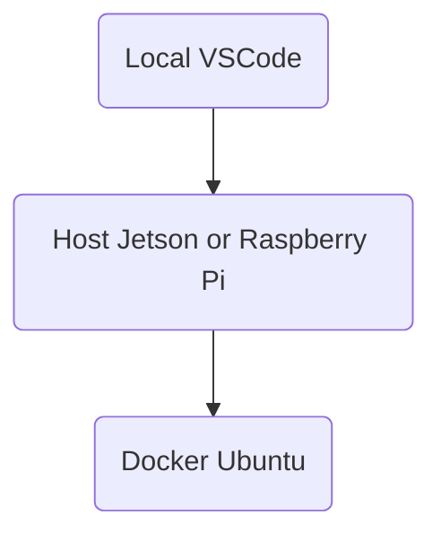

# Autonomous control system library for ROS2

高機能機械制御研究室の共通ROS2プログラム<br>
新しい計算機に導入する場合は[setup](#setup)を参照。<br>
setup後、新しいプロジェクトを作成する場合は[開発の仕方](#開発の仕方)を参照<br>
既存のプロジェクトに参加する場合は[プロジェクトに参加](#プロジェクトに参加)を参照。<br>

<!-- @import "[TOC]" {cmd="toc" depthFrom=1 depthTo=6 orderedList=false} -->

<!-- code_chunk_output -->

- [Autonomous control system library for ROS2](#autonomous-control-system-library-for-ros2)
  - [用語](#用語)
  - [リポジトリ内フォルダ構成](#リポジトリ内フォルダ構成)
  - [システム構成](#システム構成)
  - [setup](#setup)
    - [Git clone](#git-clone)
    - [systemd 登録](#systemd-登録)
  - [Debug用コマンド](#debug用コマンド)
  - [開発の仕方](#開発の仕方)
    - [機能拡張（サードパーティから持ってくる場合）](#機能拡張サードパーティから持ってくる場合)
    - [機能拡張（自作で拡張する場合）](#機能拡張自作で拡張する場合)
    - [機能拡張](#機能拡張)
    - [システム拡張](#システム拡張)
    - [](#)
  - [実行時Tips](#実行時tips)

<!-- /code_chunk_output -->


## 用語

| 表記 | 意味 |
| ---- | ---- |
| LOCAL | Hostにリモートアクセスする計算機（WindowsPCなど） |
| HOST | このプロジェクトを動かしている計算機（ラズパイなど）|
| DOCKER | @HOST上のDOCKERインスタンス |
| FC | フライトコントローラ |
| (ROS)パッケージ | 一連の機能をまとめたもの.(acs, acsl_interfaceなど)|
||package.xmlファイルが直下に入っているディレクトリ|
|||

## リポジトリ内フォルダ構成

```
.
|- .github              ：git関係（触ることはない）
|- 0_host_commands/       ：HOSTのsetup関係フォルダ
|- 1_docker/              ：DOCKER起動関係のフォルダ
|- 2_ros_packages/        ：ROSパッケージ関係のフォルダ
|- .gitignore           ：git管理から除外するファイルの設定
|- README_SYSTEM.md     ：このファイル
|- TODO.md              ：TODOタスク
```

各フォルダの詳細
|フォルダ名（パッケージ名）|概要|
|:--|:--|
|[0_host_commands](./0_host_commands/README_SYSTEMD.md)|systemdへのservice の登録関係フォルダ|
|[1_docker](./1_docker/README_DOCKER.md) | 自律制御システムを動かすためのDocker Imageの環境設定ファイル群 |
|[2_ros_packages](./2_ros_packages/README_ROS.md)|ROSパッケージをまとめたフォルダ群|

## システム構成



## setup
各ハードウェアの基本セットアップを以下からおこなう。
（imageの設定、dockerの設定まで）

[Raspberry Pi5](hardware_setup/README_raspberry_pi_5.md)<br>
[WLS2](hardware_setup/README_WSL2.md)

### Git clone

このリポジトリをクローンする

```bash
cd ~/
git clone https://github.com/acsl-tcu/ros2.git
cd ~/ros2
```

## プロジェクトに参加
既にあるプロジェクトに参加する場合

### docker image取得
プロジェクトに使うimageを取得する。
```bash
PROJECT="$PROJECT"
IMAGE=image_$PROJECT 
# IMAGE : image_drone, t265, gnss, microros, etc
docker pull kasekiguchi/acsl-common:$IMAGE
```

### git branch 切り替え
必要に応じてbranchを切り替える
```bash
cd ~/ros2
git switch "$BRANCH"
```

### systemd 登録

```bash
PROJECT="$PROJECT"
# "$PROJECT" : drone, bos, bos_robot, whill, leg-wheel, rover, turtlebot
cd ~/ros2/0_host_commands
bash setup.sh $PROJECT
source ~/.bashrc
(sudo reboot )
dps # 初回でdocker imageを取得できていない場合は表示されるようになるまで時間がかかる
dlogs "$CONTAINER"
# "$CONTAINER"は　dps で確認
```

dpsでコンテナが起動していることを確認したらRPを再起動する．

```bash
dps
sudo reboot
```

再起動後アクセスしコンテナが正常に起動していることを確認する．

```bash
dps
```

### 研究スタート
上記設定が終わったら、いよいよ研究スタート！
適宜、[開発の仕方](#開発の仕方)を参照しながら開発を進めましょう。

## Debug用コマンド

1_docker/common/scripts 内の便利コマンド

```bash
# = git pull + commitしていない編集の削除 + 権限関係の整理
gpull
# = docker ps -a
dps
# = docker stop <container_name>
dstop <container_name>
dstop all # すべてのコンテナ停止

# = docker compose up common -d + hostnameの設定
dup <container_name>
dup all # 0_host_commands/project_launch.sh を実行
# = docker compose exec common bash
din <container_name>
# コンテナ内で表示される中身についての表示（末尾１０行を継続表示）
dlogs <container_name>

# コンテナ削除
drm <container_name>
drm all # 全コンテナ削除
# = docker images -a
dimages 
# image 削除
drmi <image_name>
```

0_host_commands/setup.sh を実行時にうまくいかないとき　systemd 関係のlog を確認するのに使えるコマンド

```bash
> journalctl -xeu project_launch.service
```

## 開発の仕方
このリポジトリを使ったシステム開発の手順
**用語**
"$pack" 追加するパッケージ名(repository名)　<br>
"$pack_tag" パッケージのブランチ名<br>
"$PROJECT" パッケージを使うプロジェクト名<br>
"$EXT" docker imageの拡張名

### プロジェクトの追加
プロジェクトは**一つの計算機**上で実行するコンテナ群を管理するもの

1. vim 0_host_commands/project_launch_"$PROJECT"_sh<br>
内容はPROJECT名、ROS_DOMAIN_ID。
```bash
# sample project_launch_whill_sh
export PROJECT=whill
export ROS_DOMAIN_ID=11
```
2. bash setup.sh "$PROEJCT" <br>
systemdへproject_launch_"$PROJECT"_shを登録。ROS_DOMAIN_ID,　関連コマンド群のパスを.bashrcに登録
3. source ~/.bashrc <br>
4. vim 1_docker/dockerfiles/dockerfile."$EXT" (optional)<br>
必要に応じてイメージを拡張するファイルを追加<br>
5. dsbuild <br>
image_"$PROJECT" タグのdocker image作成<br>
4を行った場合は多段処理でimageを作るのでdsbuild のヘルプを参照
6. dupin dev<br>
ROS2パッケージ開発用コンテナを立ち上げ、コンテナ内のターミナルにattach
7. /root/project_ws/src/ros_packages/> ros2 pkg create "$PACKAGE" ... <br>
自作パッケージの開発＋デバック<br>
```bash
dev> cd /root/project_ws/src/ros_packages/
dev> ros2 pkg create "$PACKAGE" --node-name <node_name> --build-type ament_python --dependencies rclpy std_msgs sensor_msgs --maintainer-email ksekiguc@tcu.ac.jp --maintainer-name Kazuma SEKIGUCHI
#maintainerなどは適宜修正する。
dev> rbuild "$PACKAGE" # 自作パッケージのbuild 
# 詳細なデバックをする場合はVSCodeでアタッチしてデバックする。
```
container内の /root/project_ws/src/ros_packages/にパッケージ追加<br>
/root/project_ws/src/ros_packages/ は　2_ros_packages と同期されている。<br>
動作するようになったら以下のファイルを追加する。<br>
- 1_docker/common/ros_launcher/launch_"$CONTAINER".sh
- 1_docker/common/rules/"$PROJECT".rules (optional)
1で作成した project_launch_"$PROJECT"_sh に コンテナ起動用コマンドを追加し、2,3 を実行する。
8. build_project "$PACKAGES"<br>
"$PACKAGES"を指定しない場合は2_ros_packages内のすべてをcolcon buildする
7で作成した自作パッケージをimage_"$PROJECT"としてbuildした状態のimageに更新

9. docker hubに登録(optional)
dpush image_"$PROJECT"
10. dup "$CONTAINER"
コンテナ立ち上げ。目的の機能が達成されているか確認
11. sudo restart
計算機にアクセスせず機能が達成しているかを確認


### 機能拡張（サードパーティから持ってくる場合）

上記7,8の代わりに以下を実施

7. コンテナ内で機能するか確認

```bash
dupin dev
dev> cd /root/project_ws/src/
dev> git clone --depth 1 "$pack" -b "$pack_tag"
# depthや ブランチ指定は必要に応じて
dev> rbuild "$pack"
# 追加したパッケージのビルド
```

8. イメージ作成
devコンテナで機能することが確認できたらdockerfileに追加し、イメージを作り直す

```bash
# dockerfileに追加　エディタは何でも良い
vim ~/ros2/1_docker/dockerfiles/dockerfile."$project"
# image_"$project" イメージを作成
docker compose build "$project" (--no-cache)
```

## 実行時Tips

LOCALにROS2を入れ、ros2をcloneしておく。

aptで python3-pandas をインストールしておく。

```bash
# pklファイルダウンロード
~/ros2/0_host_commands/scripts/get_data 73
# sample.pyでfigure.pdf作成
python3 ~/ros2/2_ros_packages/acs/acs/Plotter/sample.py
# . を指定して実行すると currentフォルダにfigure.pdfができる。
cp figure.pdf ~/Downloads/
```
