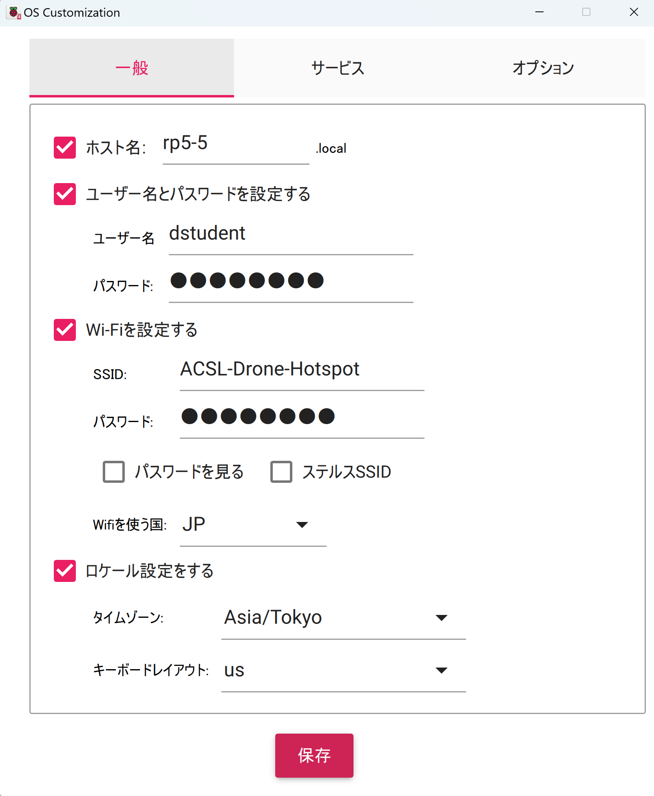
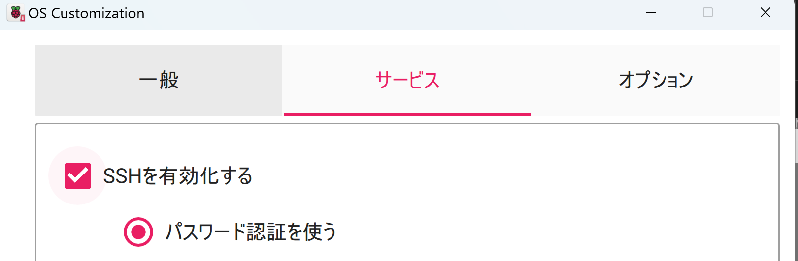

# Set up Raspberry Pi 5 
ここではRaspberry pi 5 用のセットアップについて記載する。

<!-- @import "[TOC]" {cmd="toc" depthFrom=1 depthTo=6 orderedList=false} -->

## OSイメージの設定

最新のraspberry pi os (64bit)をインストールし、SSHなどをアクティブにしておく。以下設定例
ホスト名、ユーザー名は必ず設定すること。




## i2c, spi 有効化

raspberry pi のイメージ作成時にはできない設定については起動後追加でおこなう。[GUIの場合](https://projects.raspberrypi.org/en/projects/raspberry-pi-using/9)はメニューのPreferecens> Raspberry Pi Configurationからできる。 以下は[CUIの場合](https://www.raspberrypi.com/documentation/computers/configuration.html)。

```bash
sudo raspi-config
 > Interface Options > I2C, SPI : enable
 > Performance Options > USB current : disable current limit
 > Enable Boot to Desktop/Scratch > Console Text console, requiring login (default)
 # 最後のはGUIを起動時に立ち上げない設定。自動起動で動くことが確認できたらやっておくと良い
```

## docker のインストール

RP image install ＝＞ssh でログイン後

基本的に[こちら](https://kinsta.com/jp/blog/install-docker-ubuntu/)と[こちら](https://www.kagoya.jp/howto/cloud/container/dockerubuntu/)に従うが、/etc/apt/sources.list.d/docker.listに設定するサイトがRP用に一部debianを指定している。
以下まとめ（まとめてコピペで良い）

```bash
sudo apt update
sudo apt install -y ca-certificates curl gnupg lsb-release
sudo mkdir -p /etc/apt/keyrings
curl -fsSL https://download.docker.com/linux/ubuntu/gpg | sudo gpg --dearmor -o /etc/apt/keyrings/docker.gpg
sudo chmod a+r /etc/apt/keyrings/docker.gpg

echo "deb [arch=$(dpkg --print-architecture) signed-by=/etc/apt/keyrings/docker.gpg] https://download.docker.com/linux/debian $(lsb_release -cs) stable" | sudo tee /etc/apt/sources.list.d/docker.list > /dev/null

sudo apt update
sudo apt install -y docker-ce docker-ce-cli containerd.io
sudo usermod -aG docker $USER
su - ${USER}
```

## [setupに戻る](../README.md#setup)